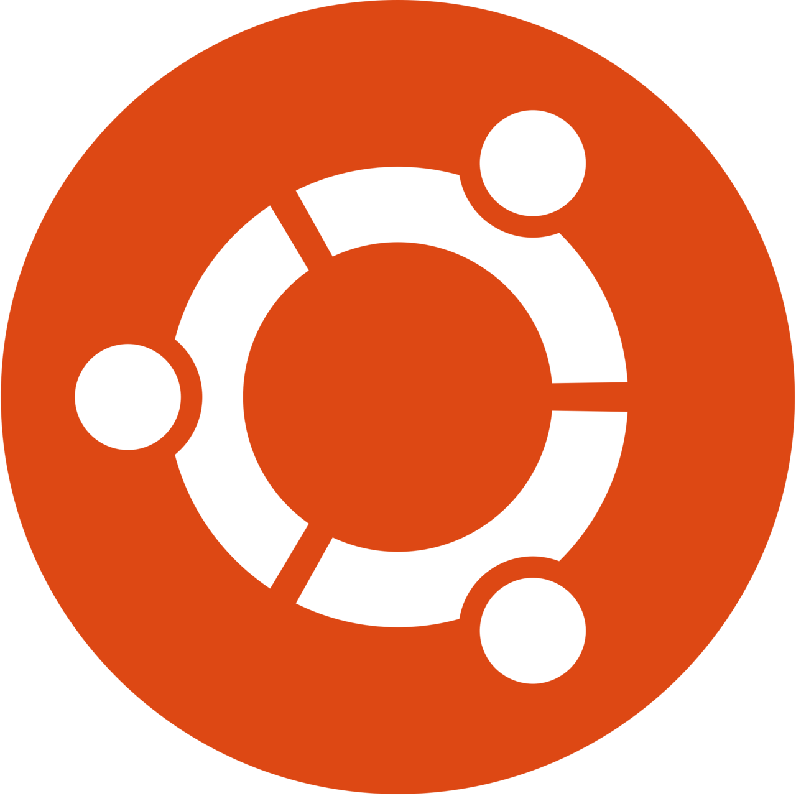

# 🟨 JavaScript (nodejs)

### Installez NodeJS et npm dans votre ordinateur

> **npm** - Gestionnaire de paquets officiel NodeJS

> Sélectionnez votre système d'exploitation



#### Installation de Nodejs et Npm

#### [Télécharger Nodejs ici](https://nodejs.org/fr/download/)


#### Vérifier l'installation de NodeJS

Ouvrez **cmd** ou **PowerShell** et tapez:

```
node -v
```

#### Vérifier l'installation de npm

Ouvrez **cmd** ou **PowerShell** et tapez:

```
npm -v
```


Si la réponse est la version dans les deux cas, cela voudra dire que c'est installé correctement!




#### Installation de Nodejs et Npm

####  Ubuntu

Si vous utilisez **Ubuntu** ou toute distribution basée dessus, sachez que la version **NodeJS** du [répositoires](https://packages.ubuntu.com/search?keywords=nodejs\&searchon=names\&suite=all\&section=all) d'**Ubuntu** est la version la plus récente (principalement des versions LTS), je vous recommande donc de suivre les instructions ci-dessous :

```
curl -fsSL https://deb.nodesource.com/setup_18.x | sudo -E bash -
sudo apt install -y nodejs
```


Le package **NodeJS** installe déjà **npm**


Autres versions, cliquez [ici](https://github.com/nodesource/distributions/blob/master/README.md#installation-instructions)

Informations sur le package des répositoires: [NodeJS](https://packages.ubuntu.com/search?keywords=nodejs\&searchon=names\&suite=all\&section=all), [npm](https://packages.ubuntu.com/search?suite=all\&section=all\&arch=any\&keywords=npm\&searchon=names)

####  Fedora

La version **NodeJS** du [répositoire](https://packages.fedoraproject.org/pkgs/nodejs/nodejs/) oficial est généralement très récent, vous pouvez l'installer avec la commande suivante dans votre Terminal :

```
sudo dnf install nodejs npm -y
```

Informations sur le package des répositoires: [NodeJS](https://packages.fedoraproject.org/pkgs/nodejs/nodejs/), [npm](https://packages.fedoraproject.org/pkgs/nodejs/npm/)

####  Arch Linux

Les répertoires d'Arch Linux et leurs dérivés, ont les derniers packages, sont disponibles **NodeJS LTS** et **Node latest**.

Tapez la commande ci-dessous pour installer la **v18.x** _(pour plus de détails, consultez_ [_Arch Wiki_](https://wiki.archlinux.org/title/Node.js#Installation)_)_

```
sudo pacman -S nodejs-lts-hydrogen npm
```

Informations sur le package des répositoires: [NodeJS](https://archlinux.org/packages/?sort=\&q=nodejs\&maintainer=\&flagged=), [npm](https://archlinux.org/packages/community/any/npm/)

#### Vérifier l'installation de NodeJS

Tapez la commande suivante dans votre Terminal:

```
node -v
```

#### Vérifier l'installation de npm

Tapez la commande suivante dans votre Terminal:

```
npm -v
```


Si la réponse est la version dans les deux cas, cela voudra dire que c'est installé correctement!



