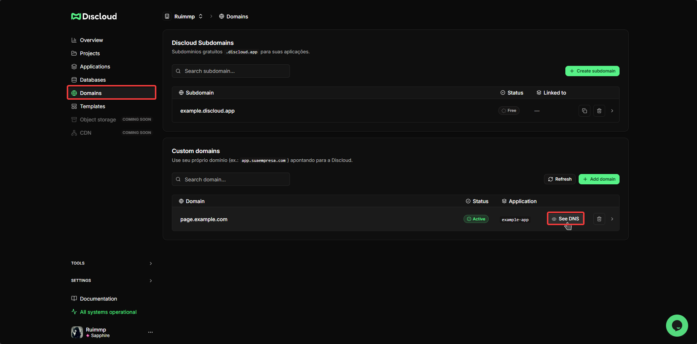
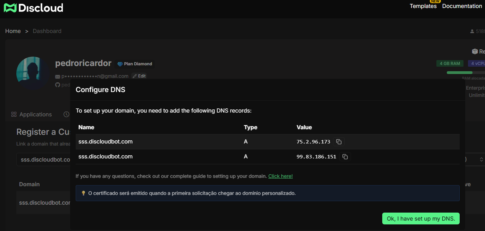
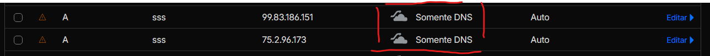
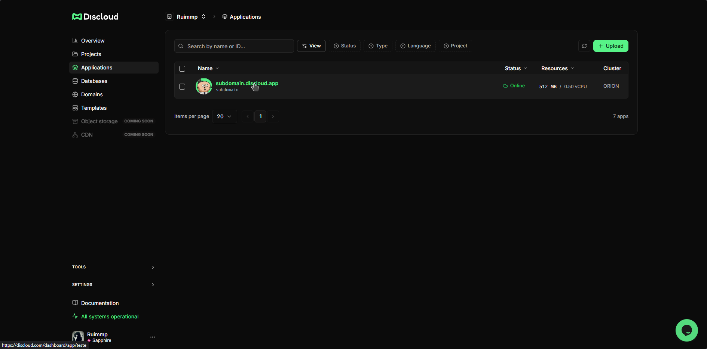
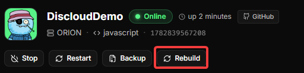

# Custom Domain

## 🧭 Overview

You can map your own domain (e.g. `yourdomain.com`) or a subdomain (e.g. `dash.yourdomain.com`) to an application hosted on Discloud. The platform serves traffic through your app's [Discloud subdomain](../faq/general-questions/how-to-create-a-subdomain.md) using two A records pointing to our IPv4 addresses and validates ownership via TXT records.

<figure><figcaption></figcaption></figure>

***

## 📋 Requirements


[Diamond plan or higher](https://discloud.com/plans) is required to host websites or APIs.



[App already hosted](../how-to-host/websites-and-apis.md) using a Discloud subdomain (e.g. `example.discloud.app`)



A registered domain you control (Cloudflare, Hostinger, GoDaddy, Namecheap, etc.)



Ability to add / modify A records


***

## 🏗️ Add Your Domain (Dashboard)



Open the [Discloud Dashboard](https://discloud.com/dashboard) → [`Domains`](https://discloud.com/dashboard/domains) section.



Enter your domain (e.g. `yourdomain.com`). Optionally specify a subdomain (e.g. `dash`).



Click **Add** and then the **DNS** button. When you click it, you will see the records you need to configure.



<figure><figcaption></figcaption></figure> <figure><figcaption></figcaption></figure>

***

## ✅ Verify & Configure DNS

Although any DNS provider works, below are tabbed scenarios for clarity.



**Records**

| Type | Name                   | Value           |
| ---- | ---------------------- | --------------- |
| A    | `@` (or provider root) | `75.2.96.173`   |
| A    | `@` (or provider root) | `99.83.186.151` |



**Example: `dash.yourdomain.com`**

<table><thead><tr><th width="144">Type</th><th width="353">Name</th><th>Value</th></tr></thead><tbody><tr><td>A</td><td><code>dash</code></td><td><code>75.2.96.173</code></td></tr><tr><td>A</td><td><code>dash</code></td><td><code>99.83.186.151</code></td></tr></tbody></table>

Multiple subdomains (e.g. `api`, `app`) repeat this pattern independently.




#### **Cloudflare Proxy**

If you use **Cloudflare**, it is mandatory to disable the **Proxy** (ensure it is set to **DNS Only** / **Grey Cloud**, not the Orange one). This ensures correct SSL certificate issuance.


<figure><figcaption></figcaption></figure>

***

## 🔄 Rebuild the App

After DNS resolves and tokens validate, open the linked app and trigger Rebuild so the binding becomes active.

<figure><figcaption></figcaption></figure> <figure><figcaption></figcaption></figure>

***

### 📡 **DNS Propagation**

* DNS changes typically propagate within a few minutes.
* However, **TTL values** and **resolver cache** may cause some delays.
* To verify changes worldwide, check [dnschecker.org](https://dnschecker.org/)
* If some POPs still display old records, wait and re-check later.

<figure><figcaption></figcaption></figure>
