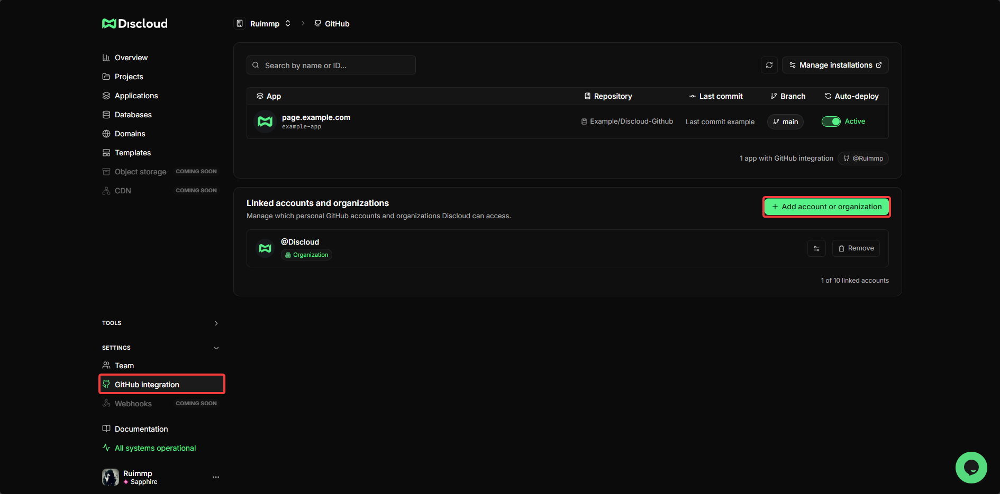
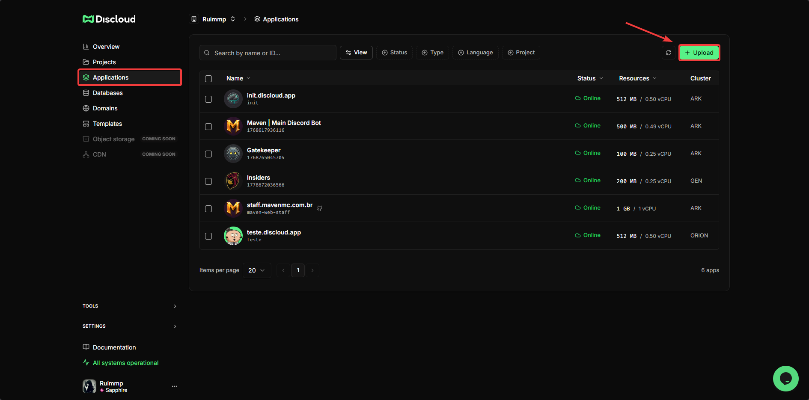
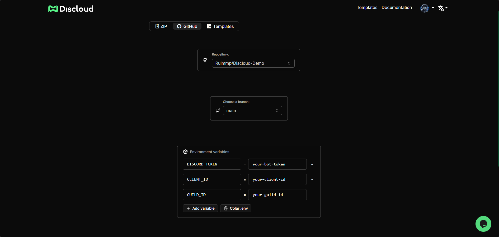
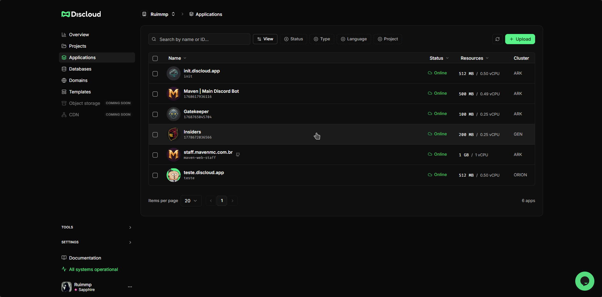

# Integração com GitHub

### 🧭 Visão Geral

A **Integração com GitHub** permite que você faça deploy de aplicações diretamente de um repositório GitHub para a Discloud, sem necessidade de enviar ZIPs manualmente. A Discloud puxa o código do seu repositório, lê o [`discloud.config`](https://github.com/discloud/docs/blob/portuguese/configurations/discloud.config) na raiz e compila e inicia sua aplicação automaticamente.

Este é o fluxo recomendado para equipes e para quem usa controle de versão como parte do processo de desenvolvimento.

***

### ✅ Pré-requisitos

Antes de conectar o GitHub, certifique-se de que o seguinte está em ordem:


[**`discloud.config`**](https://github.com/discloud/docs/blob/portuguese/configurations/discloud.config) **na raiz** - Este arquivo deve existir na raiz do seu repositório. Sem ele, o upload falhará na validação. Saiba mais sobre a raiz do projeto.



**Nunca faça commit de arquivos** [**`.env`**](../faq/general-questions/.env-file.md) - Seu arquivo `.env` deve estar listado no `.gitignore`. Os segredos de produção são definidos diretamente na Discloud durante o passo de upload, não através do repositório.


***

### 🔗 Conecte sua conta GitHub



**🔑 Abra a Integração GitHub**

No [Painel da Discloud](https://discloud.com/dashboard), expanda **Configurações** na barra lateral esquerda e clique em [**Integração com GitHub**](https://discloud.com/dashboard/github).

Clique em **+ Adicionar conta ou organização** e siga o fluxo de OAuth do GitHub para autorizar a Discloud. Isso permite que a Discloud leia seus repositórios.

<figure><figcaption></figcaption></figure>



**⚙️ Configure o acesso ao repositório**

Após autorizar, as contas e organizações conectadas aparecem na página de integração GitHub. Para gerenciar quais repositórios a Discloud pode acessar, clique em **Gerenciar instalações** (canto superior direito), isso abre as configurações do App GitHub diretamente, onde você pode escolher:

* 🔓 **Todos os repositórios** - A Discloud pode acessar todos os repositórios da sua conta
* 🔒 **Repositórios selecionados** - Escolha apenas os repositórios específicos que deseja fazer deploy


Você pode alterar isso a qualquer momento voltando para **Configurações > Integração com GitHub** e clicando em **Gerenciar instalações** novamente, ou gerenciando o App GitHub da Discloud diretamente nas configurações da sua conta GitHub.




***

### 🚀 Faça deploy pelo GitHub



**🚀 Inicie um novo upload**

Acesse a página **Applications** no [Painel da Discloud](https://discloud.com/dashboard), clique em **+ Upload** (canto superior direito) e selecione **GitHub** como tipo de deploy.

<figure><figcaption></figcaption></figure>



**🛠️ Configure o seu deploy**

**Repositório e branch** - Escolha o repositório e a branch da qual deseja fazer deploy. A Discloud vai puxar o commit mais recente dessa branch.

**Variáveis de ambiente** - Adicione os segredos de produção pelos campos `NAME` / `value.`

<figure><figcaption></figcaption></figure>


**Este é o único lugar para definir segredos de produção.** Arquivos `.env` não devem ser commitados no GitHub. A Discloud armazena esses valores com segurança e gera um arquivo `.env` na raiz da sua aplicação em tempo de execução, mantendo-os completamente fora do repositório.



Se você esquecer de adicionar uma variável aqui, sua aplicação vai iniciar sem ela e pode travar ou se comportar de forma incorreta. Para atualizar as variáveis de ambiente depois, você pode editá-las diretamente no painel caso tenha um plano pago. Caso contrário, será necessário fazer um novo commit com o conteúdo completo e atualizado do `.env`.




**✅ Confirme e faça o deploy**

Revise suas configurações e clique em **Continuar**. A Discloud irá:

1. Puxar o código do repositório e branch selecionados
2. Validar seu `discloud.config`
3. Instalar dependências e executar o comando de build (se configurado)
4. Iniciar sua aplicação

<figure><figcaption></figcaption></figure>



***

### 🔁 Atualizando sua aplicação

A Discloud faz o redeploy da sua aplicação automaticamente sempre que você fizer push de novos commits na branch configurada durante o upload inicial. Nenhuma ação manual é necessária.
