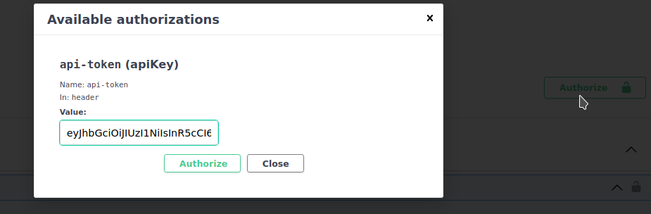
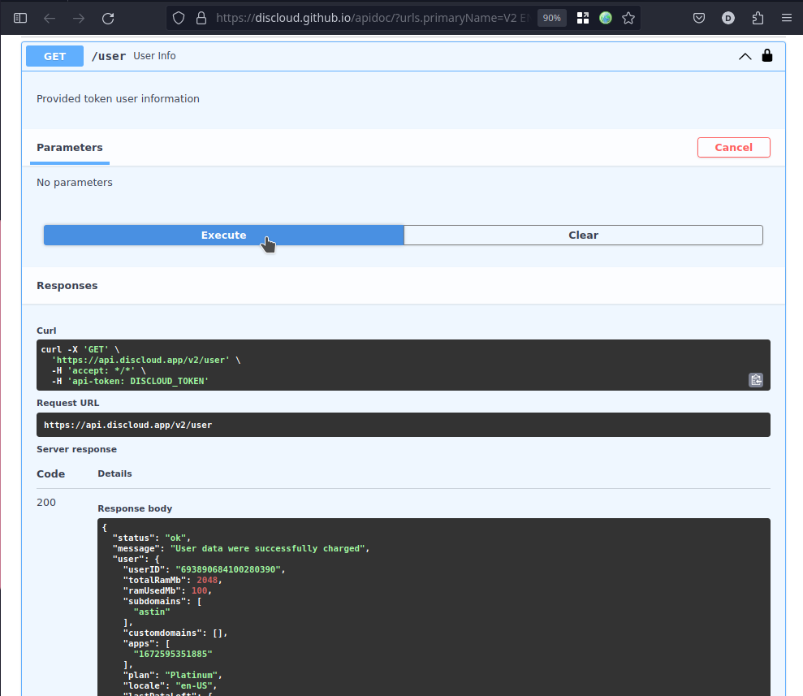
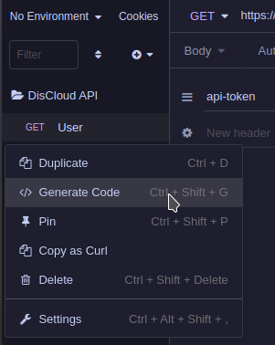
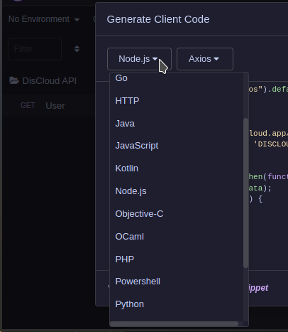
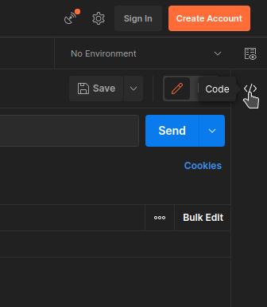
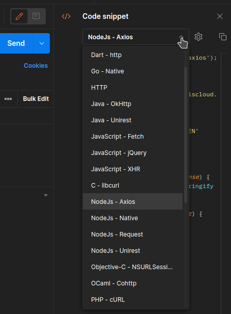
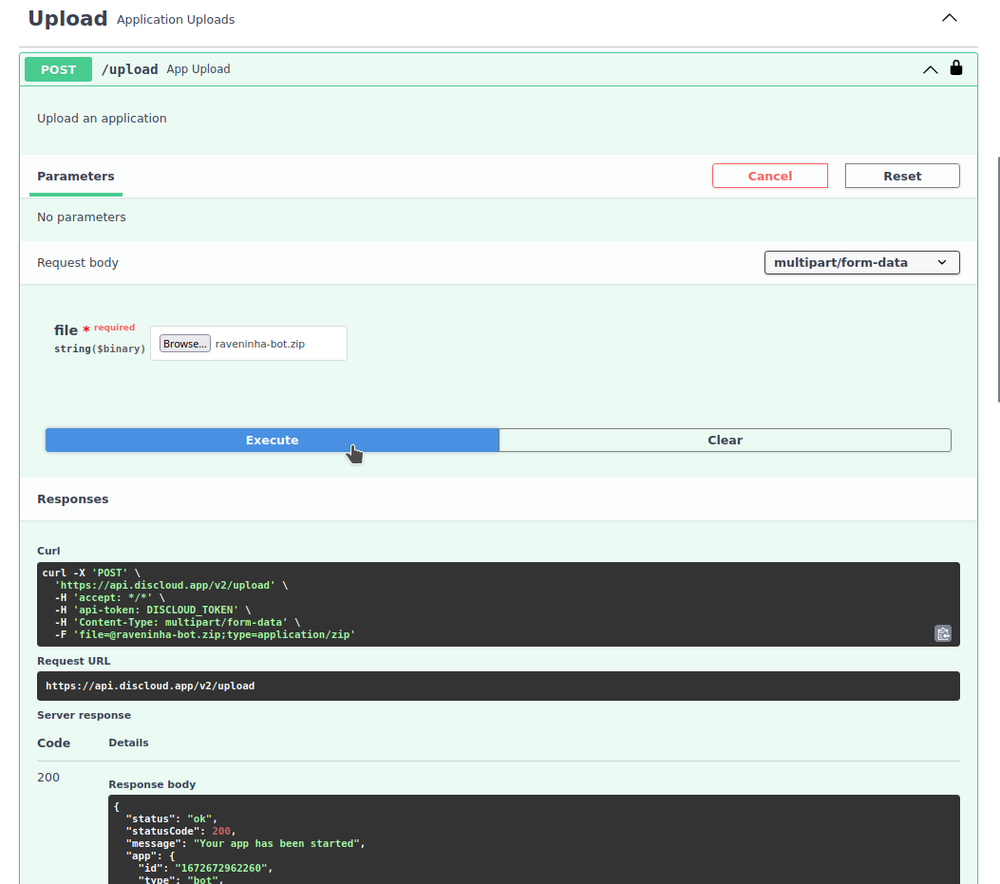

# 📡 Utiliser l'API

## :pencil: Exigences

#### Obtenir le token

Pour obtenir votre token, utilisez la commande [api](../suporte/comandos/api.md).

<figure><figcaption></figcaption></figure>

## Commencer

[Accédez aux chemins de l'API](https://discloud.github.io/apidoc/)\
Cliquez sur `Authorize` et collez votre token de l'API

<figure><figcaption>
Placer le token dans le champ
</figcaption></figure>

## Commencez à utiliser l'API

Exemple avec le chemin: `/user`

<figure><figcaption>
Exemple de la réponse
</figcaption></figure>

Vous pouvez importer le code `curl` dans des applications telles que [Insomnia](https://insomnia.rest/download) ou [Postman](https://www.postman.com/downloads/), puis générer dans la langue de votre choix à partir de celles-ci

> Exemples:




<figure><figcaption>
1
</figcaption></figure>

<figure><figcaption>
2
</figcaption></figure>





<figure><figcaption>
1
</figcaption></figure>

 

<figure><figcaption>
2
</figcaption></figure>




Exemple avec du chemin: `/upload`

* Votre fichier `.zip` doit inclure [discloud.config](../discloud.config/configurar/)
* Votre fichier `.zip` doit avoir une taille inférieure ou égale à `100MB`

<figure><figcaption></figcaption></figure>
