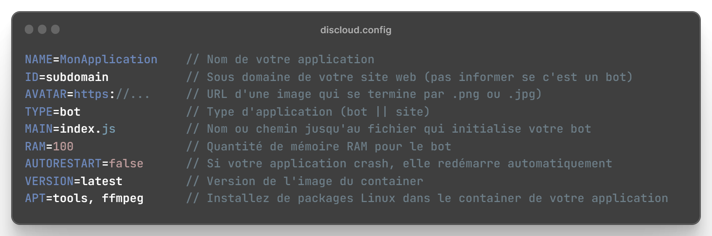
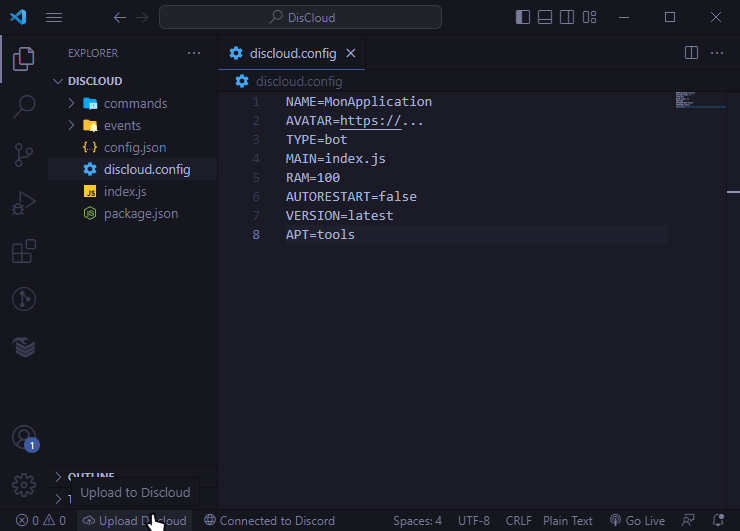
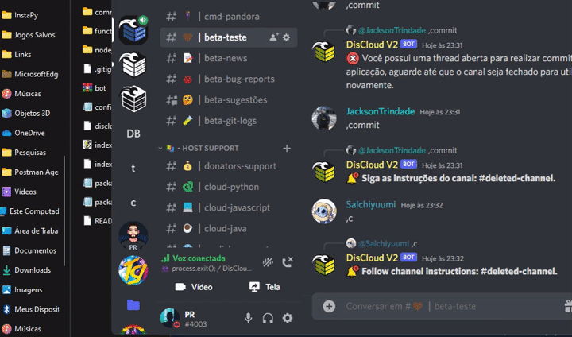

# ⚙ Configurer

`discloud.config` est une archive de configurations, qui facilite le processus de téléchargement de vos applications sur DisCloud.

## :gear: Comment Utiliser

Détails pour chaque option



> Consultez la liste des options pour: [VERSION](version.md), [APT](apt.md)

> Si vous créez un `bot` ou un `site web` vous pouvez utiliser les exemples ci-dessous :




Pour héberger un bot, vous avez besoin de **100MB** de RAM minimum!



```tsconfig
NAME=MonApplication 
AVATAR=https://... 
TYPE=bot
MAIN=index.js
RAM=100
AUTORESTART=false
VERSION=latest
APT=tools
```





Pour héberger un site web, vous avez besoin de **512MB** de RAM minimum et d'un  [Forfait Platine](https://discloudbot.com/plans)



```tsconfig
NAME=MonSiteWeb
AVATAR=https://...
ID=subdomain
TYPE=site
MAIN=index.js
RAM=512
AUTORESTART=false
VERSION=latest
APT=tools
```





Insérez votre `discloud.config` à la racine de votre projet et noubliez pas de l'inclure dans votre [.zip](../../suporte/faq/zip.md)




## :cloud: Hébergement

Avec votre [.zip ](../../suporte/faq/zip.md) créé avec `discloud.config` il est temps de l'héberger, c'est très simple à utiliser!

> * Dans le chat de commandes, utilisez `.upconfig` (ou l'abréviation `.upc`)
> * Envoyez votre zip dans le chat créé par le bot.


