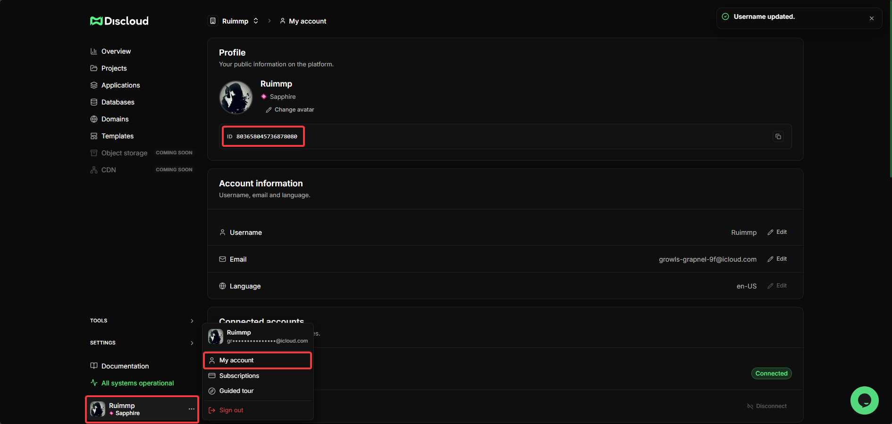

# How can I get my Discloud Account ID?

### 🪪 What is the Discloud Account ID?

The **Discloud Account ID** is a unique numeric identifier that Discloud assigns to your account at registration. Unlike the API Token, the account ID is **public information**, so you can share it without risk.

***

### 📍 Where to Find Your Account ID



Open the Dashboard: [https://discloud.com/dashboard](https://discloud.com/dashboard)



In the bottom-right corner, click on your **profile** to open the user menu.



In the menu that appears, click **My account**.



On the account information page, your **ID** appears just below your avatar.

<figure><figcaption></figcaption></figure>


