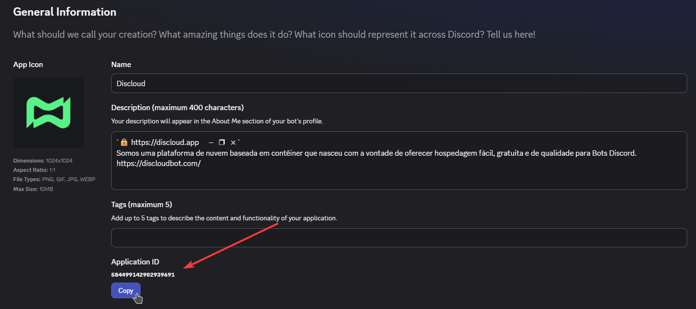

# Como posso obter o ID do meu bot do Discord?

### 🤖 O que é o ID da Aplicação do Discord?

O **ID da Aplicação do Discord** (também chamado de **Client ID**) é um identificador numérico único que o Discord atribui a toda aplicação criada no [Discord Developer Portal](https://discord.com/developers/applications).


Este **não** é o mesmo que o **ID do App da Discloud**, que a Discloud gera internamente para sua aplicação hospedada. O **ID da Aplicação do Discord** vem do próprio Discord e identifica seu bot na plataforma do Discord, ele só é necessário para o [fluxo de Configuração Rápida via o bot do Discord da Discloud](../../how-to-host-using/discord-bot.md#configuracao-rapida-guia-passo-a-passo).


***

### 📍 Como Obter o ID da Sua Aplicação do Discord



Abra o [**Discord Developer Portal**](https://discord.com/developers/applications) e faça login com sua conta do Discord.



Clique na aplicação do seu bot na lista.

Se ainda não criou uma aplicação, clique no botão **New Application**, dê um nome e crie-a.



Na página **General Information** (aberta por padrão), copie o **Client ID**, este é o ID da Aplicação do seu bot no Discord.

<figure><figcaption></figcaption></figure>




O **ID da Aplicação** é uma **informação pública**, não há problema em compartilhá-lo. No entanto, mantenha seu **Bot Token** (encontrado na aba **Bot**) **em privado**, pois qualquer pessoa com ele pode controlar seu bot.


***

### 🔍 Onde é Necessário?

Este ID é especificamente necessário ao usar o método de **Configuração Rápida** através do [Bot da Discloud](../../how-to-host-using/discord-bot.md#configuracao-rapida-guia-passo-a-passo), durante o fluxo guiado, o bot solicitará que você insira o ID da Aplicação.

Se você estiver usando a **Configuração Avançada** (com um arquivo [`discloud.config`](https://github.com/discloud/docs/blob/portuguese/configurations/discloud.config)), não precisa fornecer este ID, a Discloud lida com a configuração automaticamente.
