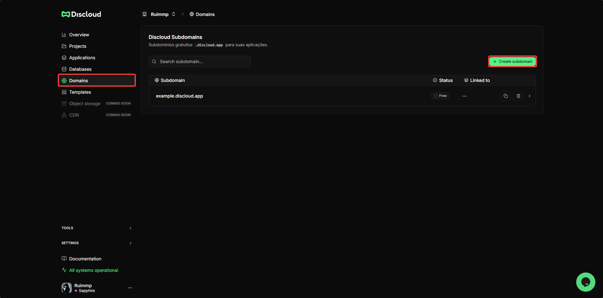
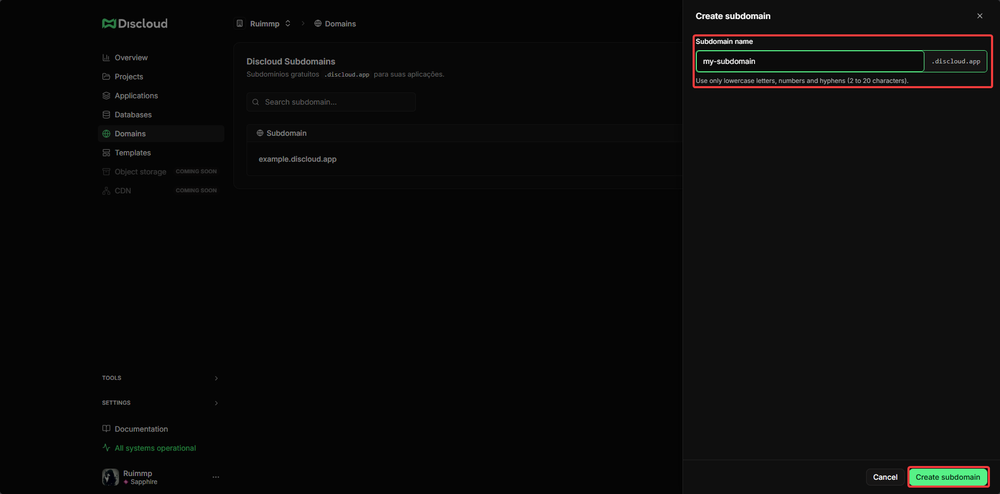

# Como criar um subdomínio?

## 🌐 O que é um Subdomínio da Discloud?

Na **Discloud**, qualquer app que utiliza uma **porta** e precisa de **acesso externo** através dela para ser acessado é considerada um site. Isso inclui bots com dashboards, dashboards, APIs, sites estáticos e dinâmicos, entre muitos outros…

Para permitir acesso externo ao seu app, a Discloud oferece a opção de criar um **subdomínio personalizado**. Esse subdomínio redireciona o tráfego através do proxy da Discloud para a **porta 8080** do seu app, permitindo que você e os usuários acessem o seu site de forma **segura e confiável**.

### 📡 Como funciona

<figure><figcaption></figcaption></figure>

***

## ✅ Requisitos

Para registrar e usar um subdomínio da Discloud, você precisa atender aos seguintes requisitos:


[Plano Platinum ou superior](https://discloud.com/plans) é necessário para hospedar sites ou APIs.



**Porta 8080** – Sua aplicação deve escutar na porta 8080 para receber tráfego externo.



**Discloud Config** – Seu app deve incluir um arquivo [discloud.config](../../configurations/discloud.config/) devidamente configurado.


***

## 🚀 Registre o seu Subdomínio



Abra o [Discloud Dashboard](https://discloud.com/dashboard).



Clique na aba `Subdomínio` no topo da página da aplicação.

<figure><figcaption></figcaption></figure>



Clique no botão `+ Subdomínio` para criar um novo subdomínio.

<figure><figcaption></figcaption></figure>



Insira o nome desejado para o subdomínio (ex.: `meuapp`, `dashboard`, `api`).


#### **Regras para nomear o subdomínio**

* Máximo de **20 caracteres**
* Apenas caracteres alfanuméricos (A–Z, 0–9) e hífens (-)
* Não são permitidos espaços, underscores ou caracteres especiais




Seu subdomínio agora está registrado e seu estado aparecerá como **Disponível**.



***

## 📝 Configure seu [discloud.config](../../configurations/discloud.config/)

Depois que o seu subdomínio estiver registrado, você deve adicioná-lo ao arquivo `discloud.config` para que a Discloud possa direcionar o tráfego para o aplicativo correto.

Abra o arquivo `discloud.config` e localize o campo `ID`:

```ini
ID=seusubdominio
```


#### **Como especificar o subdomínio no arquivo `discloud.config`?**

Use apenas o nome do subdomínio, não o domínio completo (por exemplo, use `meuapp`, e não `meuap.discloud.app`).

Exemplo:

<pre class="language-ini" data-title="discloud.config"><code class="lang-ini"><strong>ID=myapp
</strong>TYPE=site
<a data-footnote-ref href="#user-content-fn-1"># ...</a>
</code></pre>


Após atualizar o `discloud.config`, **faça o deploy da sua aplicação** para que as alterações entrem em vigor.


[Como Hospedar](https://app.gitbook.com/s/vUqkKIFudeQ2TQOirm35/how-to-host)


***

## 🔄 Estados do Subdomínio

Seu subdomínio registrado pode ter dois estados:


#### **🔵 Ativo**

* O subdomínio está **registrado e em uso**.
* Uma aplicação está atualmente em deploy e acessível em `https://seusubdominio.discloud.app`.
* O tráfego está sendo roteado para a sua aplicação na porta 8080.



#### **🟢 Disponível**

* O subdomínio está **registrado e disponível**.
* Nenhuma aplicação está usando ele no momento.
* Você pode fazer o deploy de um app para ativá-lo a qualquer momento.


***

## 🌍 Acesse Seu Site

Quando seu subdomínio estiver **Ativado**, você pode acessá-lo em:

```
https://seusubdominio.discloud.app
```

***

## ⚙️ Domínio Personalizado

Se você quiser usar seu próprio domínio (ex.: `seudominio.com`) em vez de um subdomínio da Discloud, veja:


[custom-domain.md](../../api-and-integrations/custom-domain.md)


[^1]: **Nota:** Os **`...`** apenas indicam a continuação de outras opções anteriores ou subsequentes que não são relevantes para mencionar nesta página.
