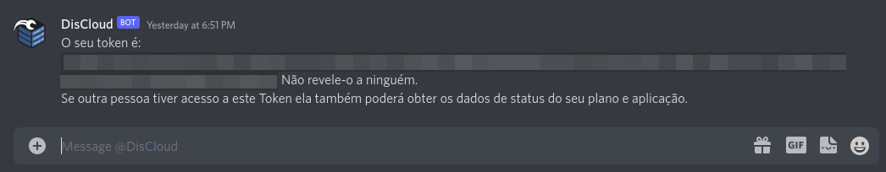

# api

**Génère un token pour utiliser l'API de DisCloud.**

## **Comment utiliser?**

#### Allez dans le canal de texte `#🔌・commands` et tapez `.api`

<figure><figcaption></figcaption></figure>

#### Votre token personnel sera envoyé dans votre MP.

<figure><figcaption></figcaption></figure>

### Comment réinitialiser mon token?

Exécutez la commande à nouveau et obtenez votre nouveau token, les tokens créés précédemment seront **invalides et ne pourront pas être utilisés**.


**Ne révélez votre token à personne**, si cela se produit, vous devez réinitialiser dès que possible.

**Remarque:** Toute personne disposant de votre token, aura un accès complet à votre compte DisCloud.

