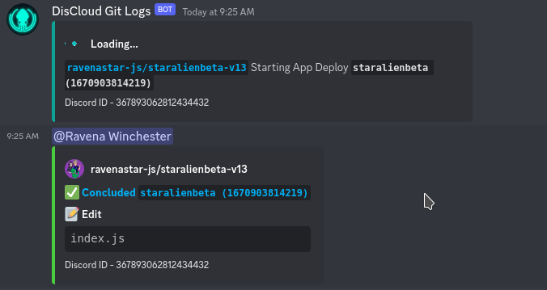
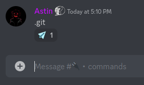
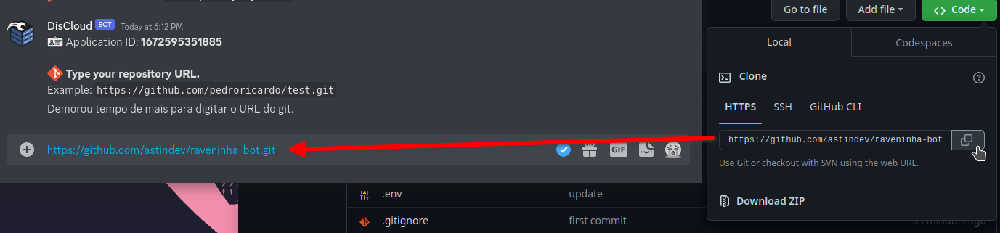
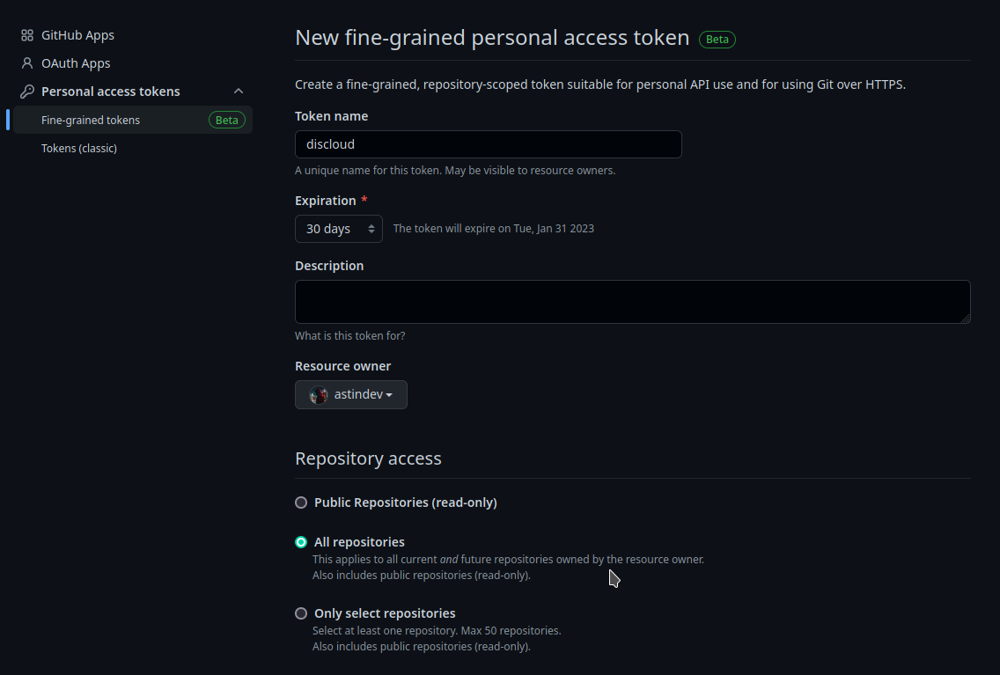
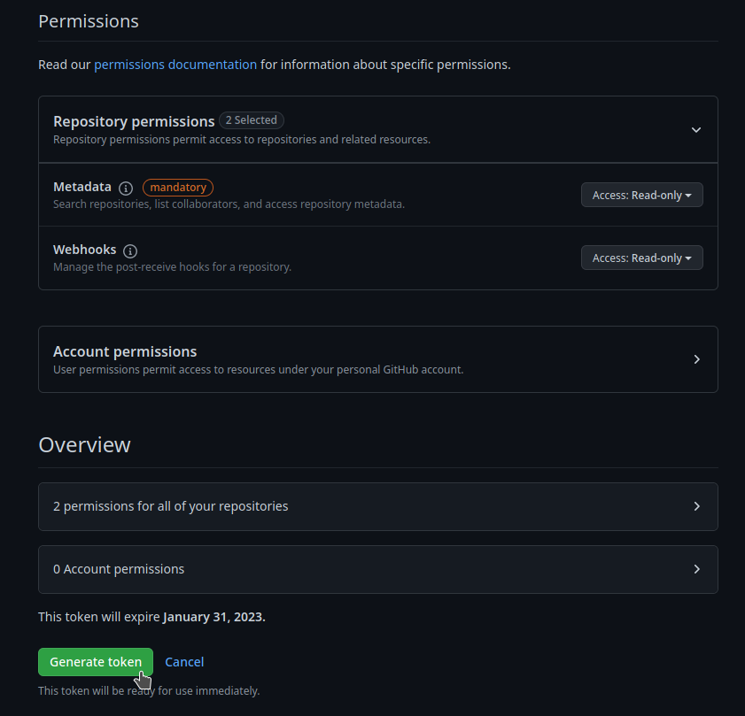
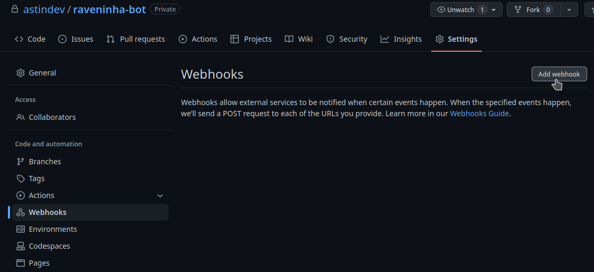
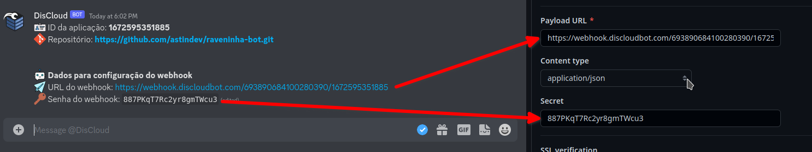

# git

Synchronisez un répertoire git avec votre application pour des mises à jour automatiques _(commits)_.

Chaque fois qu'un commit est envoyé dans le répertoire de votre application, DisCloud mettra automatiquement à jour vos fichiers d'application.

<figure><figcaption>
Exemple de git logs sur DisCloud lors d'un déploiement
</figcaption></figure>


Cette fonctionnalité n'est disponible que pour les forfaits payants.


## :pencil: Exigences

Votre application doit déjà être hébergée sur DisCloud.

## **Comment utiliser?**

#### Allez dans le canal de texte `#🔌・commands` et tapez `.git`

<figure><figcaption>
Commande .git dans le canal de commande
</figcaption></figure>




## URL du répertoire

Allez dans les MP du bot DisCloud et collez l'URL du répertoire git pour votre application.

<figure><figcaption>
Coller l'URL du répertoire
</figcaption></figure>

### Configurer le token d'accès ([Abrir Github](https://github.com/settings/personal-access-tokens/new))

Il est important que l'accès soit disponible pour tous les répertoires _(surtout si vous souhaitez activer la synchronisation pour plus d'une application)_

<figure><figcaption></figcaption></figure>

#### Configuration des permissions

Définissez `Webhooks` en lecture seule et générez votre jeton.

<figure><figcaption></figcaption></figure>

### Webhook

Ouvrez le répertoire de votre application et créez un `webhook`

<figure><figcaption></figcaption></figure>

#### Configurer le Webhook

Assurez-vous de changer le `type de contenu` en `application/json`

<figure><figcaption></figcaption></figure>


