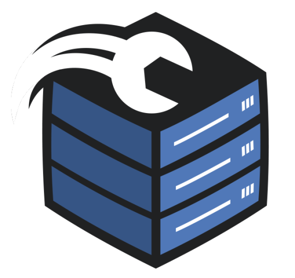

# 🤲 Doações

### :dollar: Métodos de Pagamento

<table><thead><tr><th>Método de Pagamento</th><th data-type="checkbox">Disponível via Site</th><th data-type="checkbox">Disponível via Ticket</th></tr></thead><tbody><tr><td> PayPal</td><td>true</td><td>true</td></tr><tr><td> Mercado Pago</td><td>true</td><td>true</td></tr><tr><td> Pix</td><td>false</td><td>true</td></tr></tbody></table>

###  Comprar via Site

Acesse o site [discloudbot.com/plans](https://discloudbot.com/plans) e escolha o seu plano.

###  Comprar via Ticket


Se o método de pagamento desejado estiver disponível [via site](doacoes.md#via-site) utilize apenas o **Ticket** se estiver **enfrentando problemas** de pagamento ou quando site estiver **indisponível**.


Consulte abaixo para mais detalhes:


[ticket.md](faq/ticket.md)


### :arrows\_counterclockwise: Renovar um plano

Se o [método de pagamento](doacoes.md#metodos-de-pagamento) desejado estiver disponível pelo nosso site, recomendamos que renove o seu plano por ele, assim o processo de renovação torna-se mais rápido!
