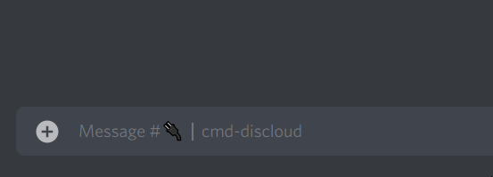

# Como fazer um Commit?

## 👨🔬 Preparando os arquivos

Selecione os arquivos que deseja atualizar em seu diretório, caso eles estejam dentro de alguma pasta, envie a pasta junto dos arquivos para que sejam alocados corretamente em seu diretório. Após preparar os arquivos, selecione-os e zipe (o formato de sua pasta compactada deve ser **`.zip`**).

Caso não saiba como compactar seu arquivos, veja este [guia](https://docs.discloudbot.com/faq/como-compactar-zipar-os-meus-arquivos).

## Commit com Deploy Automático

Através da nossa integração com o **Github** e **Gitlab** você tem a facilidade e rapidez de atualizar suas instancias DisCloud sincronizadas com seu repositório Git.


[github-e-gitlab](../integracao/github-e-gitlab/)


## Commit com Deploy Manual

###  Discord

Vá ao canal `🔌┃cmd-discloud` e digite `.commit` (caso você tenha mais de um bot é necessário informar o ID).

Feito isso, aparecerá um canal de texto com o seu Nickname e Tag (exemplo: `#SeuNick-1234`).

Dentro do canal você deve enviar o arquivo `.zip` para efetuar as alterações. Feito as alterações, você receberá uma notificação no canal `🤖┃bots-logs` de que as alterações foram concluídas.

