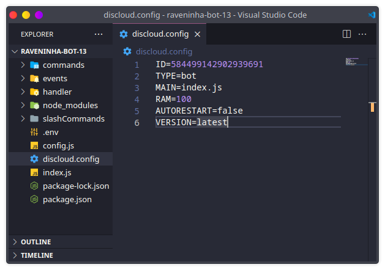
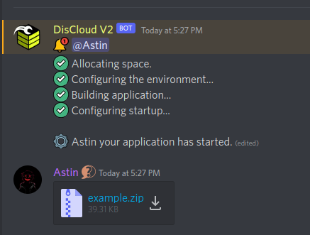

# Como utilizar o arquivo discloud.config?

#### O `discloud.config` é um arquivo de configurações predefinidas, para que você possa enviar as suas aplicações mais rapidamente, sem ter que digitar manualmente estas informações sempre que desejar fazer upload.

## :gear: Como Utilizar


```tsconfig
ID=ID_DO_BOT     // ID do seu Bot ou subdomínio do seu Site
TYPE=bot         // Tipo de aplicaçao: bot ou site
MAIN=index.js    // Nome ou caminho do arquivo principal, index.js ou src/index.js
RAM=100          // Quantidade de memória RAM em MB
AUTORESTART=false// Se a sua aplicação cair e desejar que reinicie novamente coloque true
VERSION=latest   // Muda a versao da linguagem. Use o comando .version para consultar
APT=ffmpeg       // Instale pacotes na instância Linux da sua Aplicação. Use .apt para consultar a lista de pacotes
```


> Se estiver fazendo um `bot` ou um `site` pode se basear nos exemplos abaixo:




```tsconfig
ID=584499142902939691
TYPE=bot
MAIN=index.js
RAM=100
AUTORESTART=false
VERSION=latest
```





Para hospedar um site precisa de `512MB` de ram no mínimo



```tsconfig
ID=subdominio
TYPE=site
MAIN=index.js
RAM=512
AUTORESTART=false
VERSION=latest
```





Coloque o `discloud.config` na raiz do seu projeto e nao se esqueça de incluir no seu [.zip](como-compactar-zipar-os-meus-arquivos.md)




## :cloud: Fazendo o Upload

Com o seu [.zip ](como-compactar-zipar-os-meus-arquivos.md)criado com o `discloud.config` chegou a hora do Upload, para utilizar é muito simples!

> * No canal de comandos digite `.upconfig` (ou abreviaçao `.upc`)
> * Entre no canal que o bot acabou de criar e coloque o seu .zip


