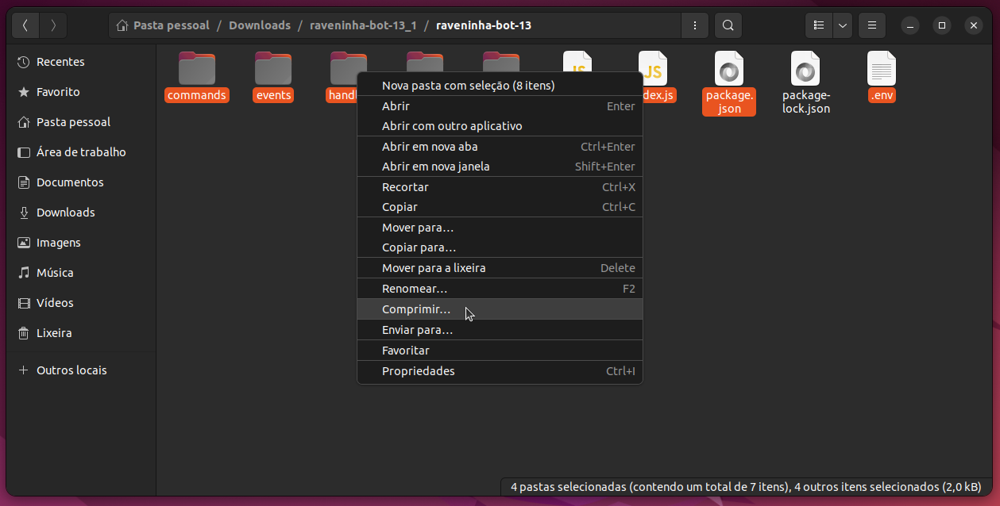
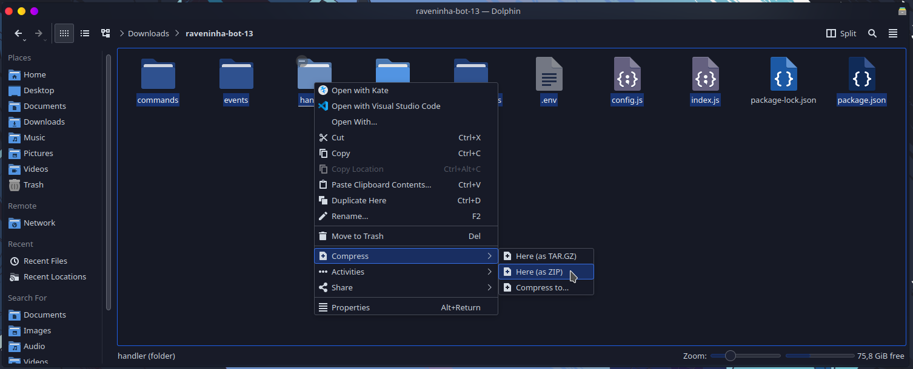
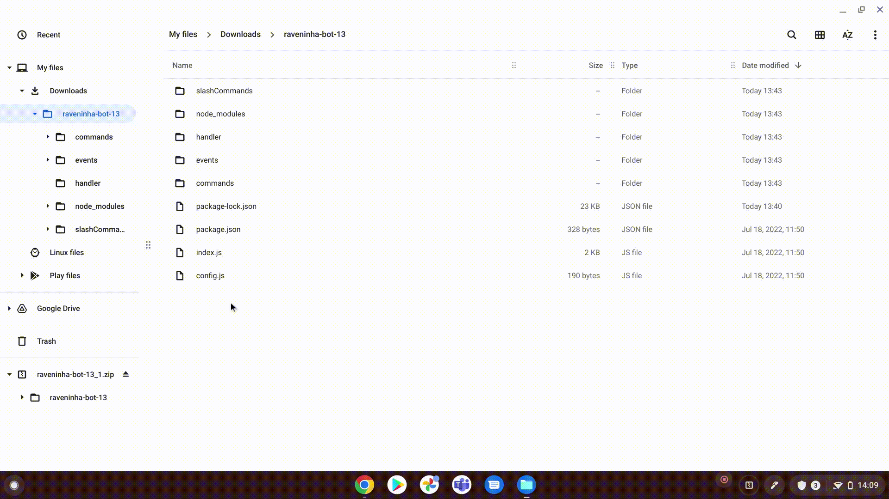

# Como compactar (zipar) os meus arquivos?

Dicas e Troques

Se a tecla `Ctrl` for pressionada enquanto um arquivo é clicado com o botão esquerdo do mouse, o estado de seleção deste arquivo é alternado.

Se o seu Bot utilizar **arquivos ocultos** como o `.env` para armazenar por exemplo o token de autenticação do bot. Você deve ativar a opção "Mostrar arquivos ocultos" no gerenciador de arquivos, para que estes possam ser selecionados

## :compression: Compactando os seus Arquivos


Selecione os arquivos necessários (dito nos tutoriais das linguagens), pois nem todos os arquivos são necessários.


#### Escolha abaixo de acordo com o seu Sistema Operacional para mais detalhes!



Após selecionar os arquivos necessários, aperte com botão direito sobre eles, arraste o mouse para **Enviar para** e clique em **Pasta compactada**.




## Ubuntu


Incluindo outras distribuições que utilizam a interface **Gnome**


Após selecionar os arquivos necessários, aperte com botão direito sobre eles, clique em **Comprimir**, escolha um nome para o arquivo e clique em **Criar**.

 

## Kubuntu


Incluindo outras distribuições com interface **Kde** Plasma.


Após selecionar os arquivos necessários, aperte com o boto direito sobre eles, Clique em **Comprimir** > **Aqui (como ZIP)**.





Nos dispositivos **Android** as fabricantes costumam enviar o sistema com **Gerenciadores de Arquivos** próprios e podem ser ligeiramente diferentes, tente replicar os seguites passos no seu dispositivo.


Aperte por algum tempo um arquivo para desbloquear a seleção, depois vá marcando apenas os **arquivos necessários**, agora procure por um ícone geralmente semelhante a 3 pontos ou traços, e por fim procure pela opção Comprimir

 



Após selecionar os arquivos necessários, aperte com botão direito sobre eles, e clique em **Zip Selection** (Seleção de Zip)



