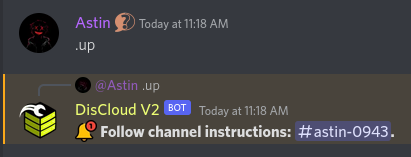
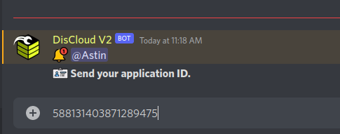
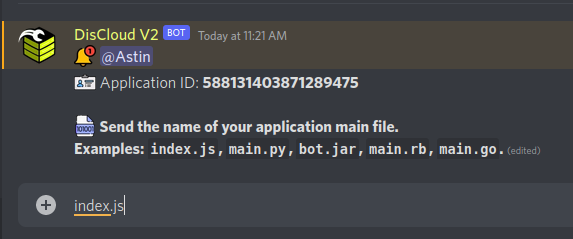
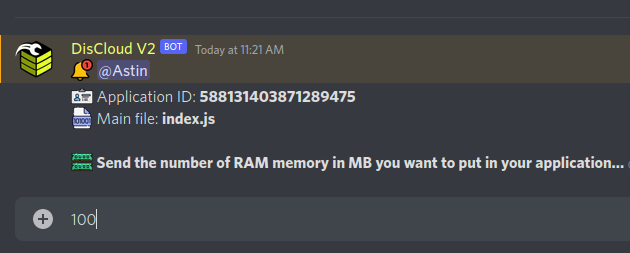
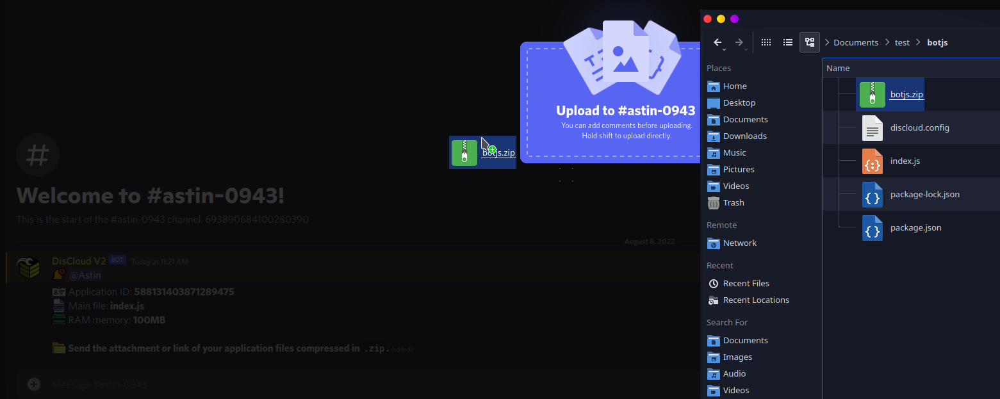

# 🔌 Via Discord

## :cloud: Avant d'héberger

Avant d'héberger, je vous recommande de consulter la documentation du langage utilisé par votre bot.


[langages](../../linguagens/)


### :robot: Hébergement de votre bot

Si vous avez la rôle `Verified en-us new`, cela signifie que vous vous êtes inscrit avec succès sur **DisCloud**.

#### 1. Pour héberger, entrez le canal de texte `#🔌・commands` et tapez `.up`( ou `.upc` pour utiliser [discloud.config](../../../discloud.config/configurar/README.md)).

#### 2. Collez l'ID de votre bot.


[id-bot.md](../../faq/id-bot.md)


#### 3. Entrez le nom de votre fichier principal.


Si votre fichier principal est dans un sous-dossier, vous devrez utiliser **discloud.config** indiquant come cet exemple: `src/index.js`



[arquivo-principal.md](../../faq/arquivo-principal.md)


#### 4. Entrez la quantité de RAM (en MB) pour votre bot.

#### 5. Envoyez le .zip de votre bot.


[zip.md](../../faq/zip.md)


> Vous pouvez vous référer aux commandes en utilisant `.help` ou `.help <command>` pour savoir comment utiliser la commande mentionnée.

### :gear: Utilisant le fichier `discloud.config`

#### Hébergez votre application encore plus rapide!


[Configurer](../../../discloud.config/configurar/)

