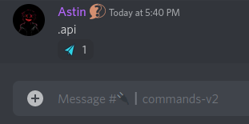
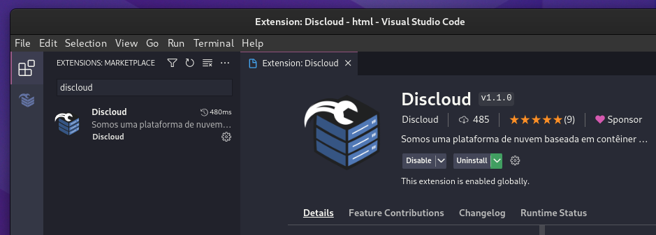
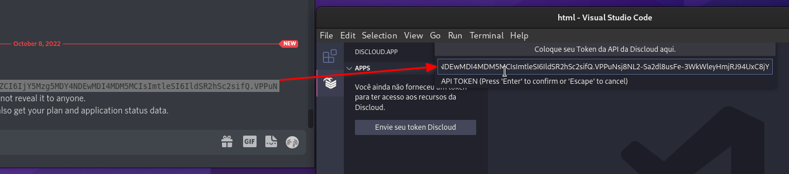
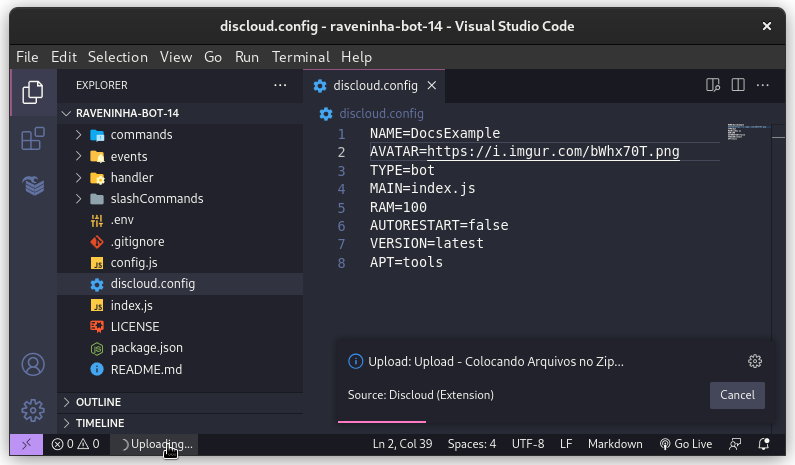

# 🧩 Via VSCode

## :pencil: Exigences

#### 1. Vous devez utiliser la commande [**api**](../../comandos/api.md)**, pour obtenir votre token de l'API de DisCloud**.

<figure><figcaption>
Utilisation de la commande .api
</figcaption></figure>

#### 2. Configurez votre `discloud.config`


[Configurer](../../../discloud.config/configurar/)


## :jigsaw: Installation de l'extension

&#x20;     [`VSCode Marketplace`](https://marketplace.visualstudio.com/items?itemName=discloud.discloud)        |        [`Open VSX Registry`](https://open-vsx.org/extension/Discloud/discloud)  \
&#x20;                    VSCode                              VSCodium, Code OSS

<figure><figcaption></figcaption></figure>

### :gear: Configuration de l'extension

#### Informez votre token de `l'API de DisCloud`

<figure><figcaption></figcaption></figure>

### :cloud: Hébergement avec l'extension


Assurez-vous d'avoir le fichier [discloud.config](../../../discloud.config/configurar/#example-to-bot) avant de continuer.


<figure><figcaption>
Réalisation de l'upload avec l'extension
</figcaption></figure>
