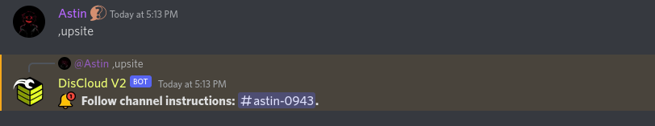
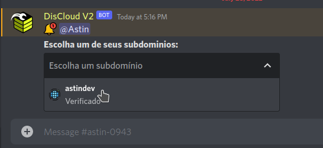

# via Discord

## :cloud: Antes de Hospedar

### Requisitos

Para hospedar sites você precisa cumprir os seguintes [requisitos](discord.md#undefined):


[.](./)


Consulte a documentação da linguagem utilizada pelo seu site.


[linguagens](../../linguagens/)


### :earth\_americas: Hospedando o Seu Site

Se você estiver com o cargo `Verified pt-br`, significa que você se registrou com sucesso na **DisCloud**.&#x20;

Para hospedar, entre no canal de texto `🤎┃commands-v2` e digite `.up`.

Dentro desse chat aparecerá as instruções que deverão ser preenchidas corretamente para evitar problemas.

> Você pode consultar os comandos utilizando `.help` ou `.help <comando>` para saber como utilizar o comando mencionado.


Se você tiver alguma dúvida em questão a como preencher corretamente as informações solicitadas pelo bot consulte no nosso [FAQ](../../faq/)&#x20;



[faq](../../faq/)



[id-bot.md](../../faq/id-bot.md)



[arquivo-principal.md](../../faq/arquivo-principal.md)



[zip.md](../../faq/zip.md)


### :gear: Utilizando o arquivo `discloud.config`

#### Envie as suas aplicações mais rapidamente!


[discloud.config.md](../../faq/discloud.config.md)

