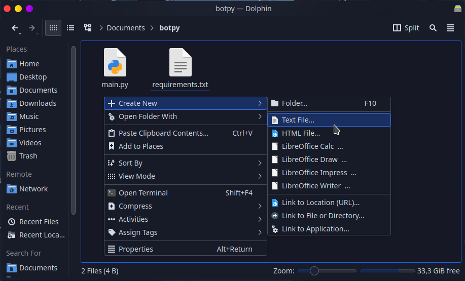
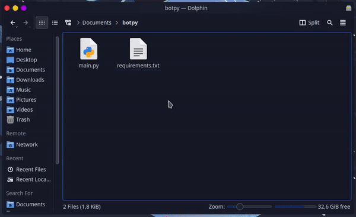

# 📄 Criar o requirements.txt

É um **simples arquivo de texto** que salva uma lista de **pacotes** necessários pelo seu projeto.&#x20;

### Como criar o arquivo `requirements.txt?`?

Comece por entrar no diretório do seu projeto e criar um novo arquivo **txt** e certifique-se de que seja **nomeado para** `requirements.txt`



### Colocando pacotes no seu `requirements.txt`


As bibliotecas não são as que você **importa** no seu código, e sim as que você instala pelo **pip install**.


### Colocando o discord.py


Se o seu bot utiliza **Slash Commands**, **Message Intent**, entre outras funcionalidades novas, recomendamos que use a versão do [**discord.py via git**](criar-requirements.txt.md#discord.py-git), pois a versão atual do [PyPI](https://pypi.org/project/discord.py/) não é atualizada desde 2021


### discord.py (git)

Adicione a seguinte linha no seu `requirements.txt`


```python
git+https://github.com/Rapptz/discord.py
```


Dessa forma conseguimos instalar pacotes **Python** que estejam disponíveis no **GitHub** mas não no **PyPI**, como versões ainda em desenvolvimento.

### discord.py (PyPI)

Adicione a seguinte linha no seu `requirements.txt`


```
discord.py
```


Quando não especificamos uma versão, o **pip** sempre tentará instalar a versão mais recente do pacote especificado. Podemos especificar versões das seguintes maneiras:

> * `discord.py==1.7.3` - Define uma versão específica a ser instalada. Fixar a versão dessa forma garante que o seu projeto vai sempre estar funcionando, caso o seu codigo ainda não esteja adaptado para uma versão superior
> * `discord.py>=1.7.3`: Quando usamos o sinal de **`>=`** estamos dizendo que queremos instalar qualquer versão superior ou igual da biblioteca.

### Colocando todos os pacotes do seu computador

Se você tiver o **Python** instalado no seu computador pode executar um simples comando no seu Terminal para colocar todas as **bibliotecas** e as **suas versões** em um `requirements.txt`


`Certifique-se de ter todos os pacotes necessários pelo seu projeto instalados no seu computador antes de executar`


Abra o Terminal no diretório do seu projeto (Windows use: **Shift+Botão Direito** e clique em **Open PowerShell**) e digite:

```
pip freeze > requirements.txt
```




Você precisa do **python e pip** instalado no seu computador, caso não esteja instalado siga as instruções abaixo.


### Instale o python e pip no seu computador

> Selecione o seu Sistema Operacional



### Instalando o python e pip

### [Baixe o Python Aqui](https://www.python.org/downloads/)


### Verifique a instalação do Python

Abra o **cmd** ou **PowerShell** e digite**:**

```
python --version
```

### Verifique a instalação do pip

Abra o **cmd** ou **PowerShell** e digite**:**

```
pip -V
```


Se retornar a versão de ambos então está instalado corretamente!




## Instalando o python e pip

### Ubuntu

Se você usa **Ubuntu** ou alguma distro baseada, digite o seguinte comando no Terminal:

```
sudo apt install python3 python3-pip
```

Informações dos pacotes dos Repositórios: [python](https://packages.ubuntu.com/search?suite=all\&section=all\&arch=any\&keywords=python3\&searchon=names), [pip](https://packages.ubuntu.com/search?suite=all\&section=all\&arch=any\&keywords=python3-pip\&searchon=names)

### Fedora

Se você utiliza **Fedora** digite o seguinte comando no Terminal

```
sudo dnf install python3 python3-pip
```

Informações dos pacotes dos Repositórios: [python](https://packages.fedoraproject.org/pkgs/python3.10/python3/), [pip](https://packages.fedoraproject.org/pkgs/python-pip/python3-pip/)

### Arch Linux

Se você utiliza **Arch Linux** ou alguma distro baseada, digite o seguinte comando no Terminal:

```
sudo pacman -S python python-pip
```

Informações dos pacotes dos Repositórios: [python](https://archlinux.org/packages/core/x86\_64/python/), [pip](https://archlinux.org/packages/extra/any/python-pip/)

### Verifique a instalação do Python

Abra o **Terminal** e digite:

```
python --version
```

### Verifique a instalação do Pip

Abra o **Terminal** e digite:

```
pip -V
```


Se retornar a versão de ambos então está instalado corretamente!



